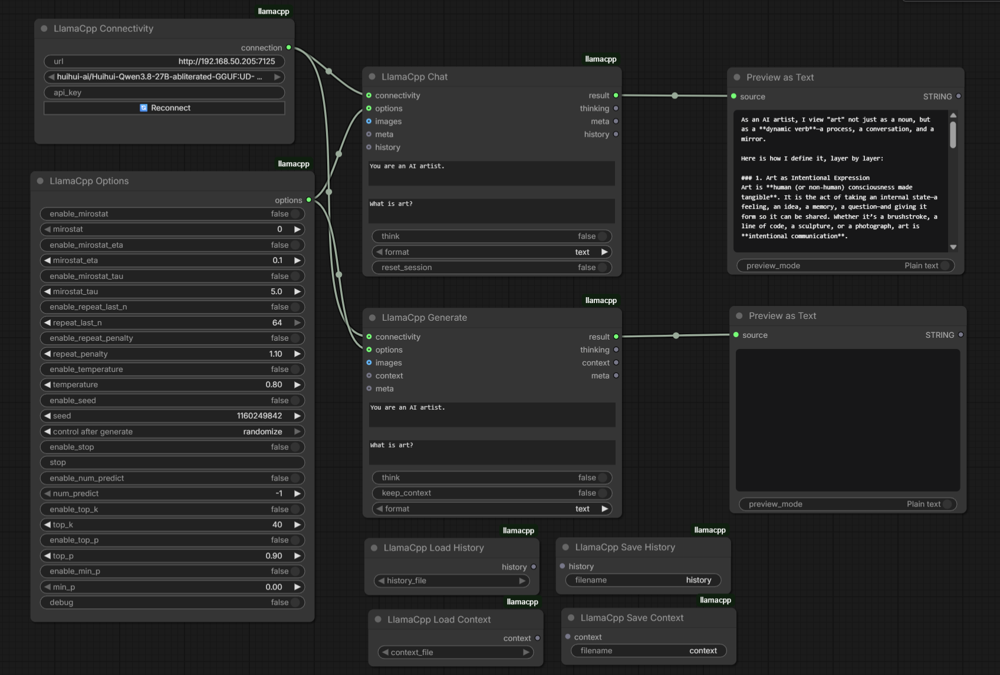

# ComfyUI llama.cpp

Custom ComfyUI nodes for [llama-server](https://github.com/ggml-org/llama.cpp/tree/master/tools/server): Connectivity, Options, Generate, Chat, Save/Load Context, and Save/Load History.

These nodes talk to a running llama-server over HTTP. They do not load GGUF files inside ComfyUI.



## Install

1. Start llama-server on a host ComfyUI can reach. Default URL is `http://127.0.0.1:8080`.

```shell
llama-server -m /path/to/model.gguf --port 8080
```

Vision models need a multimodal projector:

```shell
llama-server -m /path/to/model.gguf --mmproj /path/to/mmproj.gguf --port 8080
```

2. Clone this repo into `ComfyUI/custom_nodes/ComfyUI-llamacpp`.
3. Restart ComfyUI. No extra Python packages are required.

## Nodes

### LlamaCpp Connectivity

URL, model list (from `GET /v1/models`), and optional API key for `--api-key`.

Use **Reconnect** after the server starts or after changing models. Set `--alias` on llama-server if you want a short name in the dropdown.

### LlamaCpp Options

Enable/value sampling widgets. Only enabled values are sent.

`num_predict` maps to `n_predict` / `max_tokens`. Context size is llama-server's startup flag `-c`, not a per-request option.

### LlamaCpp Generate

System prompt, user prompt, optional images, context, and meta chaining. Calls `POST /completion`.

`keep_context` stores token ids on the node (and on the context output) so a later Generate can continue without re-processing the prefix.

### LlamaCpp Chat

Multi-turn chat via `POST /v1/chat/completions`. History is keyed by node id or a wired history output. `reset_session` clears that session.

### LlamaCpp Save / Load Context

Writes and reads Generate context token ids (`LLAMACPP_CONTEXT`) as PNG metadata in `saved_context/`. Plug Generate's **context** output into Save. Plug Load into Generate's **context** input.

### LlamaCpp Save / Load History

Writes and reads Chat message lists (`LLAMACPP_HISTORY`) as JSON in `saved_history/`. Plug Chat's **history** output into Save. Plug Load into Chat's **history** input to continue a saved conversation.

## Differences from Ollama

| Widget / feature | llama-server behavior |
|---|---|
| Default URL | `http://127.0.0.1:8080` |
| `num_predict` | Sent as `n_predict` on Generate and `max_tokens` on Chat. `-1` means unlimited. |
| Vision | Requires `--mmproj` (or auto mmproj with `-hf`). |
| Thinking | Uses `reasoning_content` / `<think>` tags and `reasoning_effort` / `enable_thinking`. |

## Examples

See `example_workflows/`. The Show Text nodes in those graphs come from [ComfyUI-Custom-Scripts](https://github.com/pythongosssss/ComfyUI-Custom-Scripts).

- `Comfy_llamacpp-text.json`
- `Comfy_llamacpp-vision.json`
- `Comfy_llamacpp-chained-generation.json`
- `Comfy_llamacpp-structured-output.json`
- `Comfy_llamacpp-chat-vision.json`
- `Comfy_llamacpp-chat-prompt-enhancement.json`
